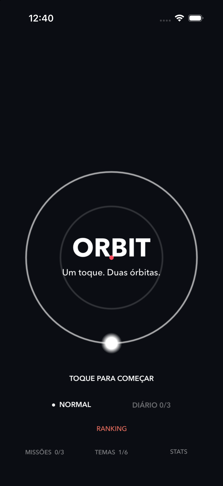
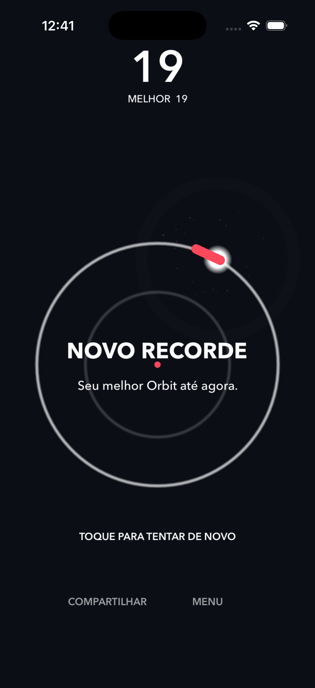

# 🪐 Orbit Game

  <strong>Um toque. Duas órbitas. Até onde você consegue chegar?</strong>

  Um arcade minimalista para iPhone, feito em Swift + SpriteKit, com partidas rápidas, dificuldade progressiva e foco em reflexo e precisão.

---

## 🎮 Sobre o jogo

**Orbit** é um jogo casual de controle com apenas um toque.

A mecânica é simples:

- a esfera gira continuamente;
- um toque alterna entre a órbita interna e a externa;
- o objetivo é desviar dos obstáculos;
- quanto mais tempo você sobrevive, mais rápido e imprevisível o jogo fica.

A ideia é manter o ciclo o mais direto possível:

> abrir → jogar → perder → tentar novamente

Sem controles complexos, sem tutoriais longos e sem depender de assets gráficos dentro do gameplay.

---

## ✨ Recursos

### Gameplay

- Controle com **um único toque**
- Duas órbitas
- Obstáculos procedurais
- Dificuldade progressiva
- Sequências de obstáculos
- Obstáculos com diferentes comportamentos
- Sistema de **Combo**
- Sistema de **Near Miss**
- Feedback háptico
- Partículas e efeitos visuais
- Screen shake
- Restart instantâneo

### Daily Orbit

Um desafio diário com:

- sequência determinística baseada no dia;
- mesma configuração diária para todos os jogadores;
- **3 tentativas por dia**;
- melhor pontuação diária separada do modo normal;
- leaderboard próprio no Game Center.

### Missões

Missões diárias envolvendo, por exemplo:

- atingir determinada pontuação;
- realizar Near Misses;
- alcançar combos;
- sobreviver por determinado tempo;
- completar partidas.

### Temas

Temas visuais desbloqueáveis por desempenho:

- Classic
- Neon
- Solar
- Ice
- Matrix
- Void

Sem moedas, gems ou sistema de compra interno.

### Estatísticas

O jogo acompanha localmente:

- melhor pontuação;
- total de partidas;
- pontos acumulados;
- Near Misses;
- maior combo;
- maior duração de partida.

---

## 🏆 Game Center

Orbit possui integração com o **Apple Game Center**.

### Leaderboards

- **Orbit Best Score**  
  Ranking global do modo Normal.

- **Daily Orbit**  
  Ranking do desafio diário.

### Achievements planejados

- First Orbit
- Getting Serious
- Orbit Master
- Untouchable
- Combo Master
- Addicted

---

## 🛠 Tecnologias

- **Swift**
- **SpriteKit**
- **SwiftUI**
- **GameKit / Game Center**
- **UserDefaults**
- APIs nativas de feedback háptico do iOS

O gameplay é desenhado programaticamente com SpriteKit.

Não há dependências externas para a lógica principal do jogo.

---

## 📱 Requisitos

- iOS 17+
- iPhone
- Orientação: Portrait

---

## 🎨 Direção visual

Orbit segue uma estética minimalista baseada em:

- fundo escuro;
- órbitas geométricas;
- tipografia limpa;
- partículas;
- glow;
- pequenos acentos de cor.

O objetivo é manter a interface visualmente simples e deixar o movimento do jogo ser o principal elemento da tela.

---

## 🔐 Privacidade

Orbit não possui conta própria, anúncios ou analytics de terceiros na versão atual.

Informações de gameplay, como estatísticas, progresso e temas desbloqueados, são armazenadas localmente no dispositivo.

Recursos de ranking utilizam o **Apple Game Center**.

📄 [Política de Privacidade](https://mtitton.github.io/OrbitGame/privacy.html)

---

## 🆘 Suporte

Encontrou algum problema ou quer enviar uma sugestão?

📧 **mvtitton@gmail.com**

🌐 [Página de suporte](https://mtitton.github.io/OrbitGame/support.html)

---

## 📸 Screenshots

  
  
  

---

## 🚀 Status

Primeira versão preparada para distribuição pela App Store.

Recursos atuais:

- [x] Gameplay infinito
- [x] Daily Orbit
- [x] Missões diárias
- [x] Temas desbloqueáveis
- [x] Estatísticas
- [x] Game Center
- [x] Leaderboard global
- [x] Leaderboard diário
- [x] Compartilhamento de score
- [x] Suporte e política de privacidade
- [ ] Achievements no Game Center
- [ ] Novos eventos procedurais
- [ ] Mais temas
- [ ] Áudio final
- [ ] Novos modos de jogo

---

## 🧭 Roadmap

Algumas ideias para próximas versões:

- Achievements pelo Game Center
- Mais variedade procedural durante as partidas
- Novos temas visuais
- Sons próprios para troca de órbita, combo e Near Miss
- Novos desafios diários
- Melhorias de acessibilidade
- Novas estatísticas
- Eventos especiais durante partidas longas

---

## 🪪 Identificação do app

**Nome:** Orbit Game  
**Bundle ID:** `com.marcustitton.orbitgame`

---

## 👤 Autor

Desenvolvido por **Marcus Titton**.

---

  <strong>ORBIT</strong> 
  Um toque. Duas órbitas.

